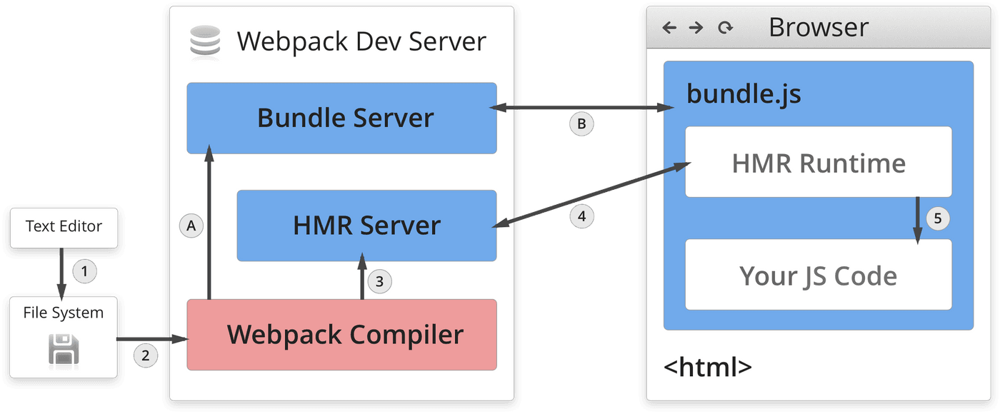
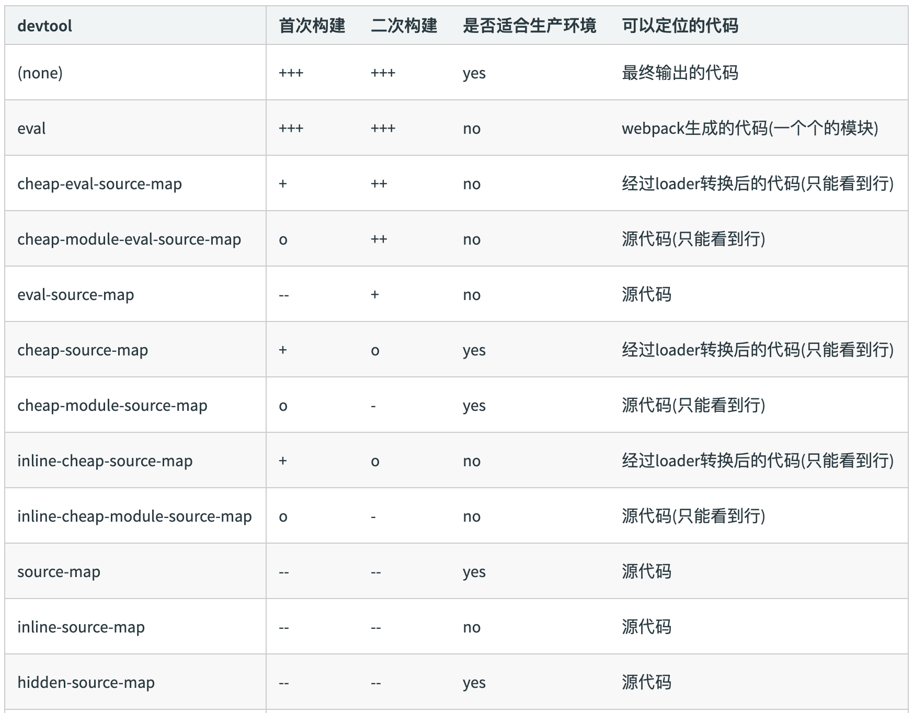

# my-webpack
webpack学习

# 通过npm script运行webpack
在项目开发中，npm在局部安装依赖后如果依赖会创建命令，那么这个依赖便会在./node_modules/.bin/ 中添加软链接，
而package.json默认会访问.bin目录。
所以在package.json中的script 中添加配置，可以更加便捷的启动webpack打包，以及其他命令。

# watch
1.在npm指令后加 --watch  
2.在webpacl.config中进行配置  
```
module.export = {
  // 默认false，也就是不开启
  watch: true,
  // 只有开启监听模式时，watchOptions才有意义
  watchOptions: {
    // 默认为空，不监听的文件或文件夹，支持正则匹配
    ignored: /node_modules/,
    // 监听到变化后回等待300ms再去执行，默认300ms
    aggregateTimeout: 300,
    // 判断文件是否发生变化，通过轮询来不停询问系统指定文件有没有变化来实现，默认每秒询问一次
    poll: 1000
  }
}
```
缺点：需要手动刷新页面来更新。

# webpack热更新
Webpack Compile: 将 JS 编译成 Bundle  
HMR Server: 将热更新的⽂件输出给 HMR Rumtime  
Bundle server: 提供⽂件在浏览器的访问  
HMR Rumtime: 会被注⼊到浏览器，更新⽂件的变化  
bundle.js: 构建输出的⽂件  

热更新分为启动阶段和更新阶段  
启动阶段：在文件系统中将初始代码通过Webpack Compile进行编译和打包，然后传输给Bundle server，Bundle server会以一个服务的形式让浏览器可以访问。
更新阶段：还是通过Webpack Compile进行编译和打包，然后发送给HMR Server，HMR Server收到后通知客户端的HMR Rumtime，HMR Rumtime就会更新我们的代码。

# 文件指纹
什么是文件指纹：打包后文件的后缀部分，通常可以用来做版本管理，且发布新版本的时候未改动文件的缓存依旧有效，可以当做一种性能优化  
文件指纹的种类  
1.Hash：和整个项⽬的构建相关，只要项⽬⽂件有修改，整个项⽬构建的 hash 值就会更改。  
2.Chunkhash：和 webpack 打包的 chunk 有关，不同的 entry 会⽣成不同的 chunkhash 值  
3.Contenthash：根据⽂件内 容来定义 hash ，⽂件内容不变，则 contenthash 不变  
js适合用chunkhash，对应entry，entry的某个js有改动，对应的chunkhash就会改变；  
css适合配合MiniCssExtractPlugin使用contenthash，  
图片和字体的hash因为默认是MD5生成的，对文件内容进行hash，所以只要内容不变hash就不变，因此使用hash做指纹即可。

# html、css、js代码压缩
js：使用[terser-webpack-plugin](https://www.webpackjs.com/plugins/terser-webpack-plugin/#root)  
css：使用[css-minimizer-webpack-plugin](https://www.webpackjs.com/plugins/css-minimizer-webpack-plugin/#root)  
html：使用[html-webpack-plugin](https://www.webpackjs.com/plugins/html-webpack-plugin/)  

# PostCss插件autoprefix自动补齐CSS3前缀
[PostCSS](https://www.webpackjs.com/loaders/postcss-loader/)是一个非常强大的CSS后处理器，它允许你在构建过程中对CSS进行转换和优化。  
使用PostCSS的Autoprefixer插件，基于Can I Use数据库中的数据，根据你所设置的浏览器兼容性配置，自动为CSS规则添加所需的前缀，以确保在不同的浏览器中正确地呈现样式。
例如：
```
.box {
  -moz-border-radius: 10px;
  -webkit-border-radius: 10px;
  -o-border-radius: 10px;
  border-radius: 10px;
}
```  

# 移动端CSS px自动转换成vw
[postcss-px-to-viewport](https://github.com/evrone/postcss-px-to-viewport/blob/master/README_CN.md#postcss-px-to-viewport)  
将px单位转换为视口单位的 (vw, vh, vmin, vmax) 的 PostCSS 插件。  
如果你的样式需要做根据视口大小来调整宽度，这个脚本可以将你CSS中的px单位转化为vw，1vw等于1/100视口宽度。  

# 静态资源内联
静态资源内联，将CSS，JS，图片等静态资源，内联到html。可以减少文件请求数量，优化加载速度。  
使用raw-loader进行html和js的内联  
html：  
```
<%= require('raw-loader!./meta.html').default %>
```
js：  
```
<script type="text/javascript"><%= require('raw-loader!babel-loader!../../node_modules/postcss-px-to-viewport').default %></script>
```
css：  
```
const HtmlInlineCssPlugin = require('html-inline-css-webpack-plugin').default;
plugins: [ new HtmlInlineCssPlugin() ]
// 或者使用style-loader
{
  loader: 'style-loader',
  options: {
    insertAt: 'top', // 样式插入到 <head>
    singleton: true, //将所有的style标签合并成一个
  }
},
```

# Source-map
通过 source map 定位到源代码。  
```
devtool: 'source-map'
```
eval: 使⽤eval包裹模块代码  
source map: 产⽣.map⽂件  
cheap: 不包含列信息  
inline: 将.map作为DataURI嵌⼊，不单独⽣成.map⽂件  
module:包含loader的sourcemap  
